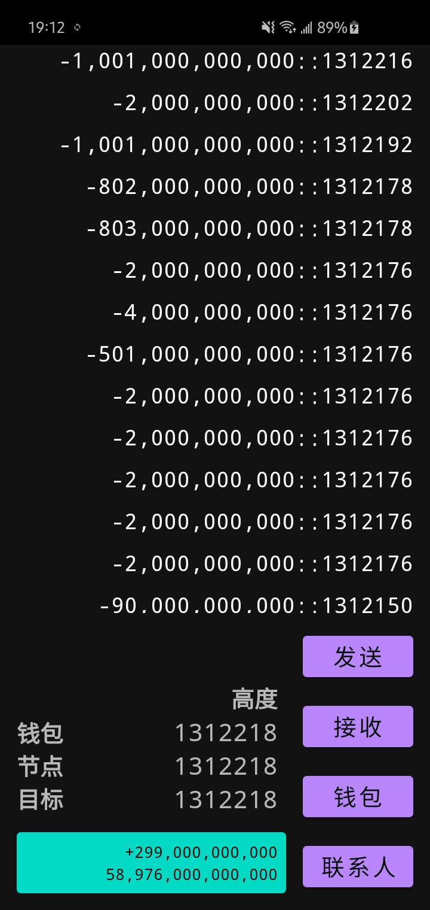

# aeon-wallet-app

aeon-wallet-app is a wallet for AEON cryptocurrency on your android device. It requires [aeond-app](https://github.com/yorha-0x/aeond-app) to connect to AEON network. 

## Installation

* Enable install from unknown sources in Android configuration (Settings -> Security). 
* Install [aeond-app](https://github.com/yorha-0x/aeond-app).
* Build aeon-wallet-app or download it in the [release section](https://github.com/yorha-0x/aeon-wallet-app/releases).
* Start aeond-app.
* Create a wallet. 

## Build it yourself

This app largely follows the same build process as [monerujo](https://github.com/m2049r/xmrwallet/) but with some variations for AEON.

* Get AEON on https://github.com/aeonix/aeon. 
* Install these: `sudo apt-get install make python libtool g++ libncurses5 cmake build-essential git pkg-config libboost-all-dev libssl-dev libzmq3-dev libunbound-dev libsodium-dev libunwind-dev liblzma-dev libreadline-dev libldns-dev libexpat1-dev doxygen graphviz libpgm-dev libnorm-dev`
* Build scripts require Android NDK r15c in `/opt/android`. See `script/env.sh`.
* Minor changes to aeon source code are necessary before compiling. These can be observed in `script/aeon-patch.sh`
* Next, change directory to `external-libs` and run `make`. This will create the necessary lib files for the app.
* After this is all completed, you will be able to open the app in Android Studio and build.

### [Dependencies](https://github.com/yorha-0x/aeon-wallet-app/blob/master/app/build.gradle#L46)

For QR:

* `com.google.zxing:core:3.4.1`
* `androidx.camera:camera-camera2:1.0.0-rc02`
* `androidx.camera:camera-lifecycle:1.0.0-rc02`
* `androidx.camera:camera-view:1.0.0-alpha21`
* `com.google.mlkit:barcode-scanning:16.1.1`

User interface libraries:

* `com.google.android.material:material:1.3.0`
* `androidx.appcompat:appcompat:1.2.0`
* `androidx.constraintlayout:constraintlayout:2.0.4`
* `androidx.navigation:navigation-fragment:2.3.3`
* `androidx.navigation:navigation-ui:2.3.3`
* `androidx.recyclerview:recyclerview:1.1.0`
* `androidx.preference:preference:1.1.1`

### [Permissions](https://github.com/yorha-0x/aeon-wallet-app/blob/master/app/src/main/AndroidManifest.xml#L8)

* `CAMERA` for QR scanning. Requested before usage.

## License

Licensed under the Apache License, Version 2.0.
http://www.apache.org/licenses/LICENSE-2.0
